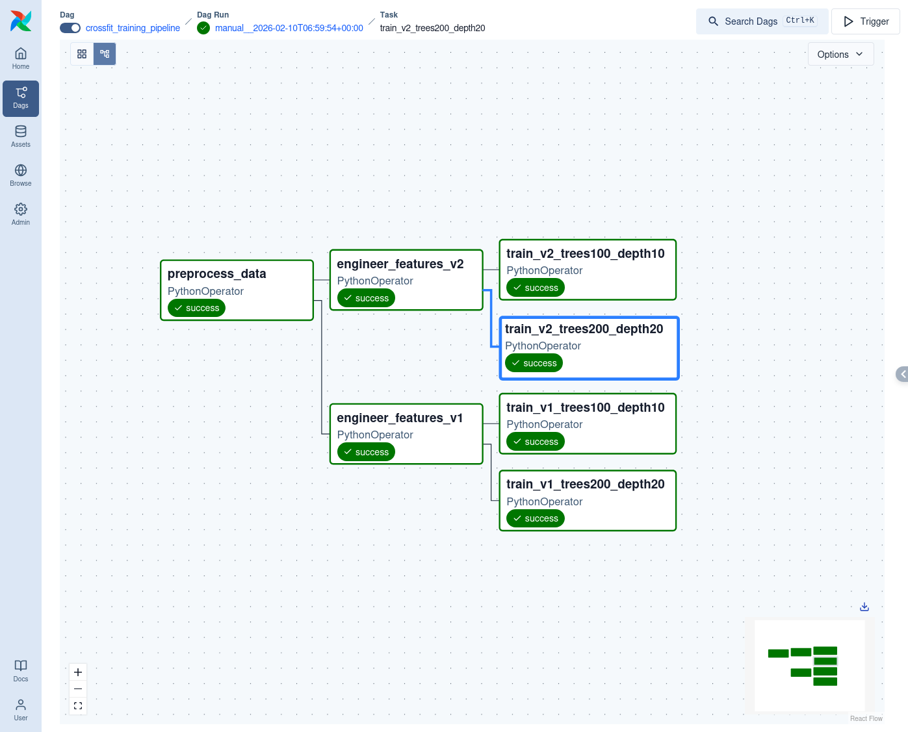
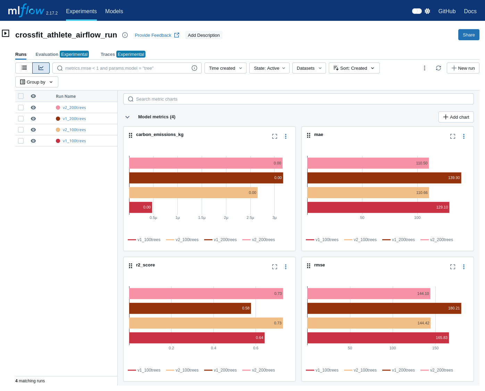
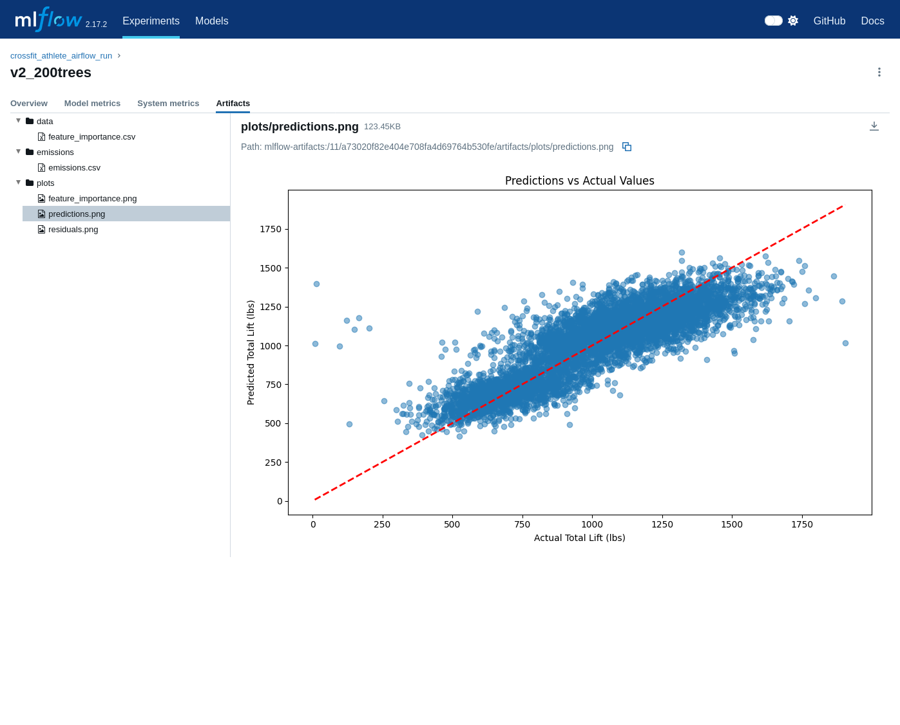
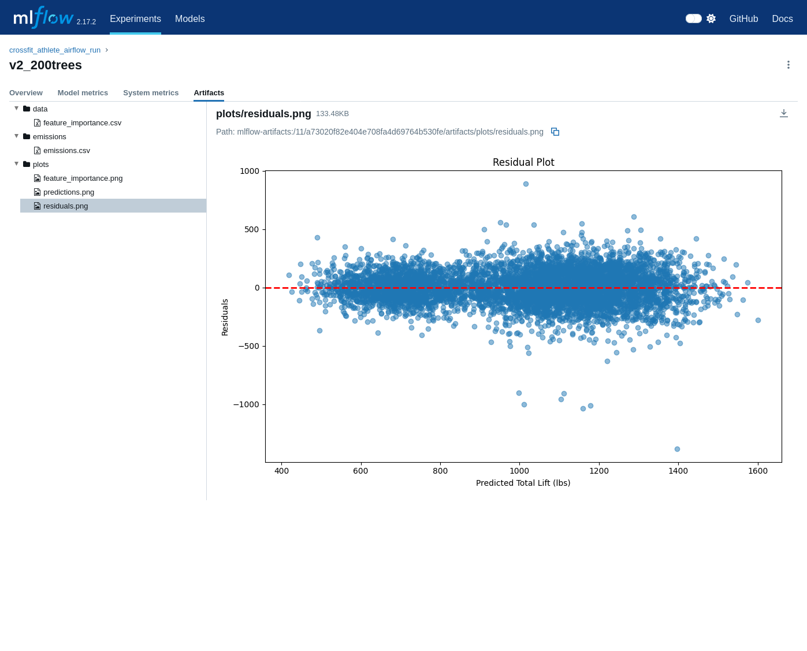
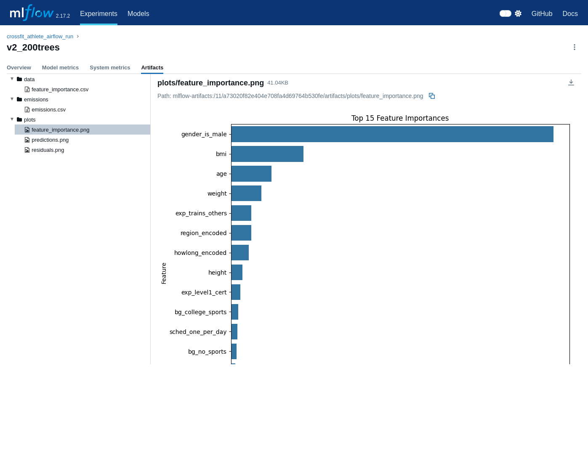

# ML Experiments with Feature Store and ML Pipelines: CrossFit Athlete Performance

This project is to design end-to-end MLOps pipeline predicting CrossFit athlete total lift using Airflow for orchestration, MLFlow for experiment tracking, Feast for feature management, and CodeCarbon for emissions monitoring.

---

## Table of Contents

1. [Prerequisites](#prerequisites)
2. [Project Structure](#project-structure)
3. [Architecture](#architecture)
4. [Quick Start](#quick-start)
5. [Pipeline](#pipeline)
6. [Results](#results)

For detailed usage instructions see [USAGE.md](USAGE.md).

---

## Prerequisites

- Docker Engine
- Astro CLI: `curl -sSL install.astronomer.io | sudo bash -s`
- VSCode with Dev Containers extension (optional, for local development)

---

## Project Structure

```
ml-pipeline-project/
├── dags/
│   ├── training_pipeline.py     # Main ML training DAG (4 parallel runs)
│   └── test_connections.py      # Connectivity verification DAG
│
├── include/                     # Mounted into Airflow containers at runtime
│   ├── src/
│   │   ├── data/preprocess.py   # Data cleaning, outlier removal, target creation
│   │   ├── features/engineer.py # Feature engineering (V1: 5 features, V2: 32 features)
│   │   └── models/train.py      # Training loop, MLFlow logging, CodeCarbon tracking
│   ├── data/
│   │   ├── raw/athletes.csv     # Source dataset
│   │   └── processed/           # Parquet files written by Airflow tasks
│   └── feast/
│       └── repo/feature_repo/
│           ├── feature_store.yaml      # Feast config (local provider, SQLite stores)
│           ├── feature_definitions.py  # FileSource paths + FeatureView schemas
│           └── data/                   # registry.db, online_store.db (git-ignored)
│
├── services/
│   ├── docker-compose.yaml      # MLFlow server + PostgreSQL backend
│   └── Dockerfile.mlflow        # MLFlow image with psycopg2
│
├── .devcontainer/               # VSCode dev container (Python 3.11 + ML deps)
│   ├── devcontainer.json
│   └── Dockerfile
│
├── notebooks/                   # Jupyter notebooks for exploration
├── docker-compose.override.yml  # Joins Airflow scheduler to ml-network
├── airflow_settings.yaml        # Connections and variables (local dev only)
├── requirements.txt             # Airflow container Python deps
├── Dockerfile                   # Astro Runtime 3.1 (Airflow container base)
├── start-all.sh
└── stop-all.sh
```

---

## Architecture

### Two Docker Stacks

The project runs as two separate compose stacks that share a Docker network:

```
┌─────────────────────────────────────┐  ┌──────────────────────────────────────────┐
│  services/docker-compose.yaml        │  │  astro dev (auto-generated compose)       │
│                                      │  │                                            │
│  mlflow-server (port 5000)           │  │  airflow-scheduler                         │
│  mlflow-postgres                     │  │  airflow-webserver (port 8080)             │
│                                      │  │  airflow-triggerer                         │
│  Network: ml-network (bridge)        │  │  airflow-postgres (metadata)               │
└─────────────────────────────────────┘  │                                            │
                    │                    │  + ml-network (via override)               │
                    └────────────────────┤                                            │
                    shared network       └──────────────────────────────────────────┘
```

**docker-compose.override.yml** at the project root is automatically picked up by the Astro CLI and attaches the `scheduler` container to `ml-network`, allowing Airflow tasks to reach `mlflow-server` by hostname.

### Path Mapping

The `include/` directory is bind-mounted with different base paths in different contexts:

| Context | Base path | Example |
|---|---|---|
| Dev container / host | `/workspace/` | `/workspace/include/data/raw/athletes.csv` |
| Airflow containers | `/usr/local/airflow/` | `/usr/local/airflow/include/data/raw/athletes.csv` |

**All hardcoded paths in DAGs, `include/src/`, and `feature_definitions.py` use the Airflow container path** (`/usr/local/airflow/`). This is the primary path convention for this project.

### DAG Structure

```
preprocess_data
    ├─> engineer_features_v1
    │       ├─> train_v1_trees100_depth10
    │       └─> train_v1_trees200_depth20
    │
    └─> engineer_features_v2
            ├─> train_v2_trees100_depth10
            └─> train_v2_trees200_depth20
```

The four training tasks run in parallel once feature engineering is complete, each logging a separate MLFlow run with its own metrics, plots, and emissions report.

---

## Quick Start

### 1. Start the MLFlow stack

```bash
cd services
docker compose up -d
cd ..
```

Wait until `docker compose -f services/docker-compose.yaml ps` shows both services as healthy.

### 2. Start the Airflow stack

```bash
astro dev start
```

This builds the Airflow image, applies `docker-compose.override.yml`, and starts the Airflow services. On first run it also imports `airflow_settings.yaml`.

### 3. Initialise the Feast registry

The Feast registry must be built from inside the Airflow scheduler container (so paths resolve correctly):

```bash
docker exec -it $(docker ps --filter name=scheduler -q) bash -c \
  "mkdir -p /usr/local/airflow/include/feast/repo/feature_repo/data && \
   cd /usr/local/airflow/include/feast/repo/feature_repo && feast apply"
```

> **This step is required on first setup and after any change to `feature_definitions.py`.**
> The registry is a SQLite file that stores the absolute data-source paths used at training time.

### 4. Access UIs

- **Airflow:** http://localhost:8080 (admin / admin)
- **MLFlow:** http://localhost:5000

### 5. Verify connectivity

Trigger the `test_connections` DAG in the Airflow UI — both the MLFlow and Feast tasks should succeed.

### 6. Run the training pipeline

Trigger `crossfit_training_pipeline` manually. All four training tasks should complete green, with results visible in MLFlow under the `crossfit_athlete_airflow_run` experiment.

---

## Pipeline

The Airflow DAG runs four training tasks in parallel after preprocessing and feature engineering complete. Each task corresponds to a unique combination of feature version and hyperparameters, and logs independently to MLFlow.



---

## Results

Four model variants are trained in parallel, comparing feature set depth (V1: 5 features vs V2: 32 features) against tree count and depth (100/depth-10 vs 200/depth-20). All runs are tracked in MLFlow.

### Experiment Comparison — Metrics & Emissions

The MLFlow runs table shows RMSE, MAE, R², and kg CO₂ emissions side-by-side across all four variants. V2 features consistently outperform V1, and deeper trees yield modest gains at a small emissions cost.



### Predictions vs Actual

Scatter plot of predicted vs actual `total_lift` values on the held-out test set. Points clustered tightly around the diagonal indicate strong predictive accuracy.



### Residuals

Residual plot showing prediction error distribution. A well-centred spread around zero with no systematic pattern confirms the model is not biased toward high or low lift values.



### Feature Importance

Top 15 features ranked by Random Forest mean decrease in impurity. V2's categorical features (schedule, background, experience) rank alongside the core anthropometric inputs, demonstrating the value of the richer feature set.


